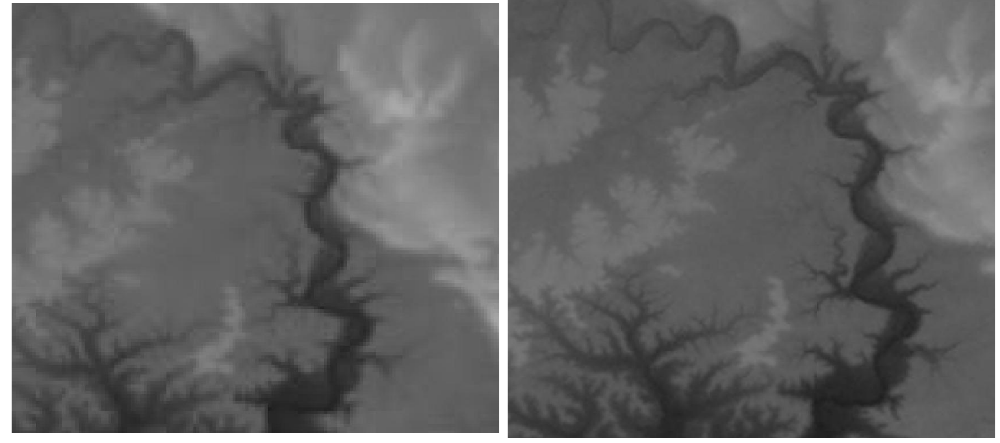

## Super-Resolution of Digital Elevation Models using Adverserially Trained U-Net based Convolutional Residual Network with Attention.

This repository contains the code and notebooks for the project that competed at the Grand Finale of Smart India Hackathon 2022 for Department of Space, Indian Space Research Organisation (ISRO)'s probelm statement on *Super-Resolution of Digital Elevation Models* (SS600). The project was developed by team **sCUDA_Divers** from **Jamia Millia Islamia, New Delhi**.
#### Team Members
1. [Mohammed Abbas Ansari](https://github.com/m-abbas-ansari/) (Team Leader)
2. [Mohammed Azhan](https://github.com/sheikhazhanmohammed/) (Team Mentor)
3. [Uzma Firoz Khan](https://github.com/uzma024/)
4. [Mohammad Kashif](https://github.com/M0hammad-Kashif/)
5. [Md Haider Zama](https://github.com/haiderzm/)
6. [Saquib Ali](https://github.com/saquibali7/)
6. Mohammad Aatir Nadim

### Approach

Dataset was created by taking DEMs captured by [USGS's LiDAR](http://shadedrelief.com/SampleElevationModels/), [NASA's ASTER](https://www.youtube.com/watch?v=roryIlOEWlI&ab_channel=GeoDeltaLabs) and [ISRO's CartoSAT](https://bhuvan-app3.nrsc.gov.in/data/download/tools/document/cartodem_bro_final.pdf) at multiple resolutions of varying terrains.

The dataset was then split into training and validation sets. The training set was used to train the model and the validation set was used to evaluate the model. The model was trained for 500 epochs with a batch size of 4. The model was trained on Google Colab's GPU.

Training data was created by considering the captured DEMs as the ground truth and the downsampled versions of the same DEMs as the input. The downsampled versions were created by using the bilinear interpolation method. The downsampled versions were then passed through the model to generate the super-resolved versions of the same DEMs. The super-resolved versions were then compared with the ground truth to evaluate the model.

### Model Architecture and Loss Function

The model architecture used for this project is a combination of the [U-Net](https://arxiv.org/abs/1505.04597) and [ResNet](https://arxiv.org/abs/1512.03385) architectures. ResNet blocks were used in both the encoder and decoder part of the U-Net. [Efficient Attention](https://arxiv.org/abs/1812.01243) was used after each ResNet block in the encoder. [Channel and Spatial Attention](https://www.sciencedirect.com/science/article/pii/S1000936121003459) is used after each ResNet block in the decoder. The output image is two times larger the input image. The model was trained using the [Adversarial Loss](https://arxiv.org/abs/1611.07004) to improve the quality of the super-resolved images. A combination of [L1 Loss](https://arxiv.org/abs/1701.03022), [SSIM Loss](https://arxiv.org/abs/1511.08861) and Edge Loss was used to train the model.

Edge loss is computed using the [Sobel Edge Detector](https://en.wikipedia.org/wiki/Sobel_operator). The Sobel Edge Detector is used to detect the edges in the ground truth and the super-resolved images. The edge loss is then computed by taking the difference between the edges detected in the ground truth and the super-resolved images.

### Results

The model was able to generate super-resolved images of high quality. The results are shown below.

**SuperResolution of a 90m DEM to a 30 m DEM:** 

Network-Defintion-Training.ipynb contains the code for training the model. You can run the notebook on Google Colab, but may need to curate the dataset yourself. Dataset and replicating code is not yet released since **research work is still underway.**

